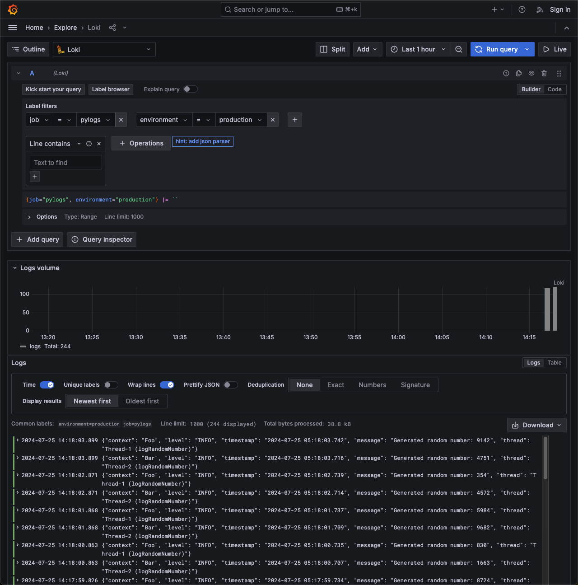

*****************
Loki
*****************

Integrating Python Applications with Grafana Loki
=================================================

When aiming to send logs from your Python application to Grafana Loki, using a JSON format for logs can simplify label management and enhance log organization. `logman` facilitates this by leveraging Python's standard logging module to perform JSON formatting and store log files that can be tailed by agents.

This guide will walk you through the process of setting up `logman` to send logs to Loki using both Promtail and Grafana Agent.

Why JSON Formatting?
---------------------

JSON formatting allows for better structured logs, making it easier to parse and manage labels in Loki. With `logman`, you can seamlessly integrate JSON formatting into your Python application's logging setup.

Setup and Deployment
====================

In this section, we'll use a simple Python application that generates random numbers and logs them. We'll deploy this application and Promtail using Docker Compose. Promtail will track the log files and send them to Loki.

Step 1: Python Application
---------------------------

Create a simple Python application that logs random numbers. Save this as `main.py`:

.. code-block:: python

    import random
    import time
    import threading
    from logman import LoggerFactory

    class Foo:
        def __init__(self) -> None:
            self.logger = LoggerFactory.getLogger(self.__class__.__name__)

        def logRandomNumber(self) -> None:
            while True:
                self.logger.info(f"Generated random number: {random.randint(1, 10000)}")
                time.sleep(1)

    class Bar:
        def __init__(self) -> None:
            self.logger = LoggerFactory.getLogger(self.__class__.__name__)

        def logRandomNumber(self) -> None:
            while True:
                self.logger.info(f"Generated random number: {random.randint(1, 10000)}")
                time.sleep(1)

    if __name__ == "__main__":
        foo = Foo()
        bar = Bar()

        # Create threads for Foo and Bar logging
        foo_thread = threading.Thread(target=foo.logRandomNumber)
        bar_thread = threading.Thread(target=bar.logRandomNumber)

        # Start the threads
        foo_thread.start()
        bar_thread.start()

        # Join the threads to the main thread to keep them running
        foo_thread.join()
        bar_thread.join()

Step 2: Docker Compose Setup
----------------------------

Create a `docker-compose.yml` file to define the services. This setup will include the Python application and Promtail.

.. code-block:: yaml

    version: '3.8'

    services:
      app:
        build:
          context: .
          dockerfile: app.dockerfile
        volumes:
          - logs:/app/logs
        environment:
          - PYTHONUNBUFFERED=1

      loki:
        image: grafana/loki:2.9.2
        ports:
          - '3100:3100'
        command: -config.file=/etc/loki/local-config.yaml

      grafana:
        environment:
          - GF_PATHS_PROVISIONING=/etc/grafana/provisioning
          - GF_AUTH_ANONYMOUS_ENABLED=true
          - GF_AUTH_ANONYMOUS_ORG_ROLE=Admin
        entrypoint:
          - sh
          - -euc
          - |
            mkdir -p /etc/grafana/provisioning/datasources
            cat <<EOF > /etc/grafana/provisioning/datasources/ds.yaml
            apiVersion: 1
            datasources:
            - name: Loki
              type: loki
              access: proxy 
              orgId: 1
              url: http://loki:3100
              basicAuth: false
              isDefault: true
              version: 1
              editable: false
            EOF
            /run.sh
        image: grafana/grafana:latest
        ports:
          - '3000:3000'

      promtail:
        image: grafana/promtail:2.9.2
        volumes:
          - logs:/var/logs
          - ./promtail-config.yml:/etc/promtail/promtail-config.yml
        command: -config.file=/etc/promtail/promtail-config.yml

    volumes:
      logs:

.. tip::
    The provided docker-compose.yml file is an example configuration for development and testing purposes.
    For production, it is recommended to set up Grafana and Loki separately to better manage and scale your logging infrastructure.

Step 3: Promtail Configuration
------------------------------

Create a `promtail-config.yml` file to configure Promtail to send logs to Loki.

.. code-block:: yaml

    server:
      http_listen_port: 9080
      grpc_listen_port: 0

    positions:
      filename: /tmp/positions.yaml

    clients:
      - url: http://loki:3100/loki/api/v1/push

    scrape_configs:
      - job_name: logman
        static_configs:
          - targets:
              - localhost
            labels:
              job: pylogs
              __path__: /var/logs/*.log
              environment: production

.. tip::
    Ensure that you customize the clients URL to match your Loki server's address, especially if it's hosted remotely or under a different port.

    .. code-block:: python

        clients:
          - url: http://<YOUR_LOKI_SERVER>:<YOUR_LOKI_PORT>/loki/api/v1/push

        scrape_configs:
          - job_name: <YOUR_JOB_NAME>
            static_configs:
              - targets:
                  - <YOUR_TARGET>
                labels:
                  job: <YOUR_JOB_LABEL>
                  __path__: <YOUR_LOG_PATH>
                  ...
                  

Step 4: Build and Run
---------------------

Build and run the Docker Compose setup to start the Python application and Promtail.

.. code-block:: bash

    docker-compose up --build

This command builds the Docker images and starts the containers. Promtail will start tailing the log files generated by the Python application and send them to Loki.

Step 5: Viewing Logs in Grafana
-------------------------------

After starting the Docker Compose setup, you can view the logs in Grafana. Follow these steps:

1. Open your web browser and navigate to `http://localhost:3000`.
2. You will be automatically logged in as an anonymous user with admin privileges.
3. In the Grafana dashboard, click on the **Explore** icon on the left sidebar.
4. In the **Explore** view, select **Loki** as the data source from the dropdown at the top.
5. Enter the following query to view the logs:

  .. code-block:: text

      {job="pylogs", environment="production"}

6. Press **Run query** to fetch and display the logs from Loki.

You should see the logs generated by your Python application, formatted as JSON, and sent to Loki by Promtail. This allows you to monitor your application logs in real-time and utilize Grafana's powerful visualization and querying capabilities.

With this setup, you have successfully integrated your Python application's logging with Grafana Loki, enabling efficient log management and analysis.

Summary
=========

Using logman with JSON formatting simplifies the management of logs in your Python application. By integrating with tools like Promtail or Grafana Agent, you can efficiently send these logs to Grafana Loki for centralized logging and monitoring.

For more detailed examples and advanced configurations, explore the individual modules and classes in the documentation. If you have any questions or need further assistance, please feel free to reach out to our support team.

